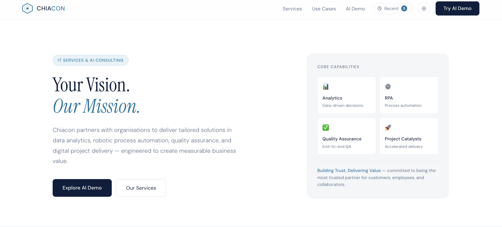
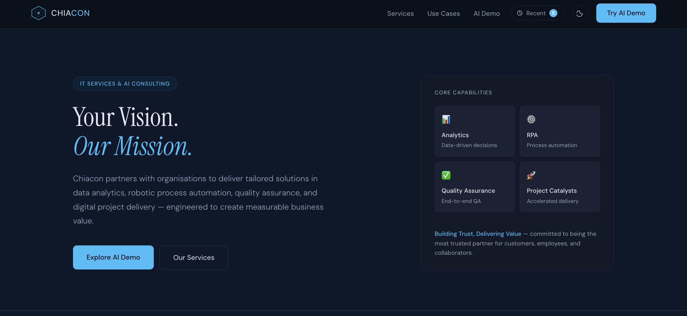
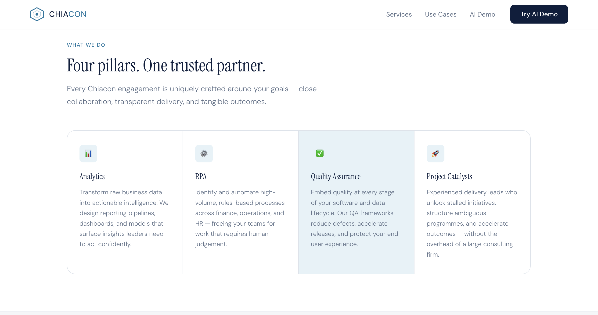
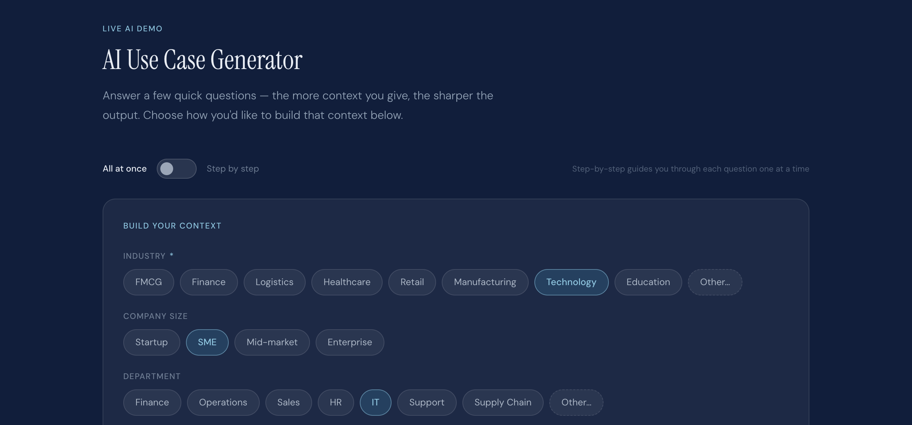
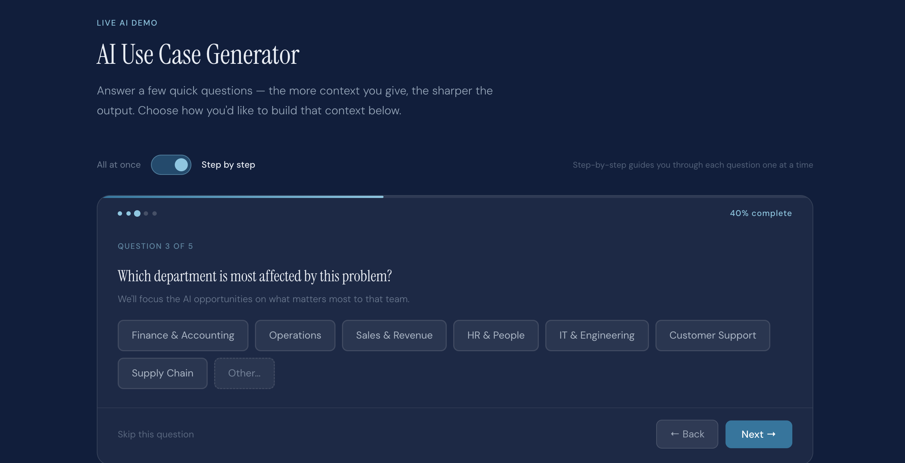
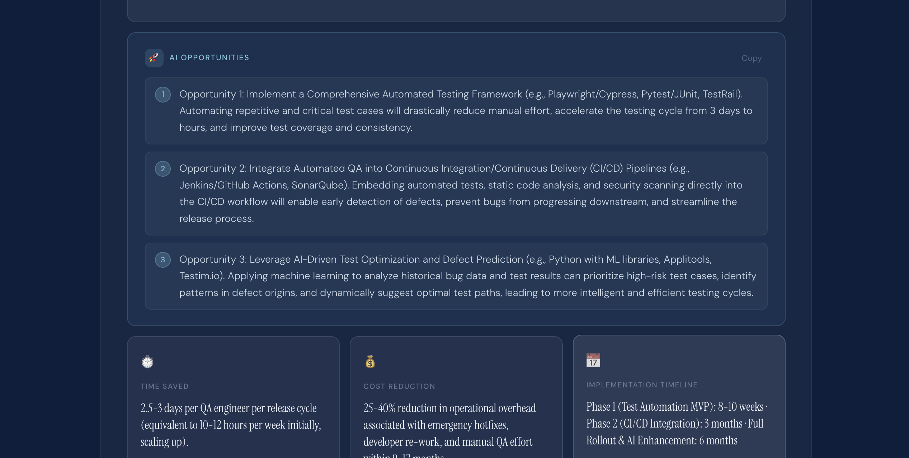
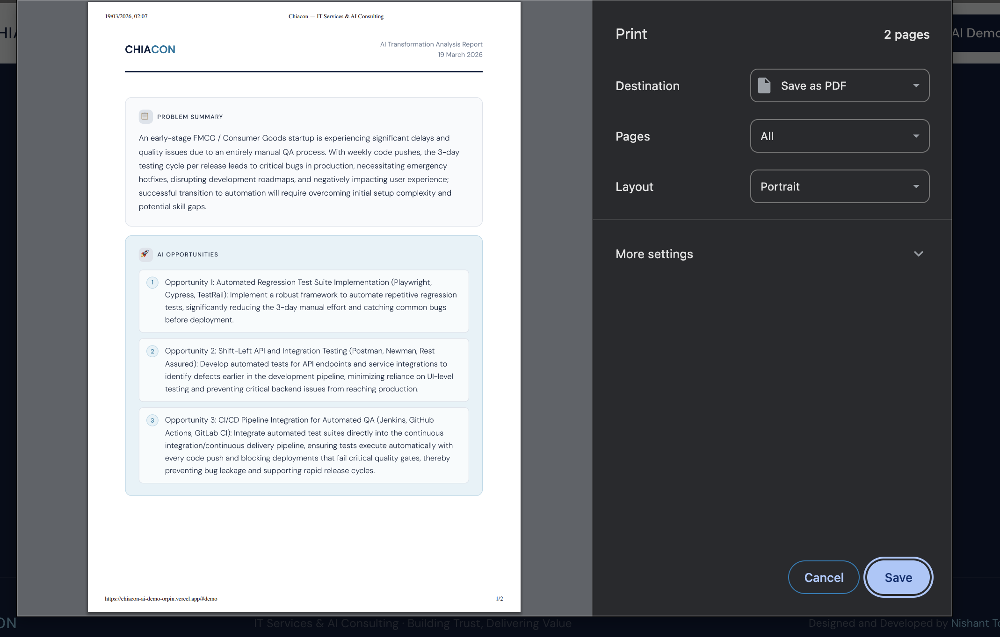
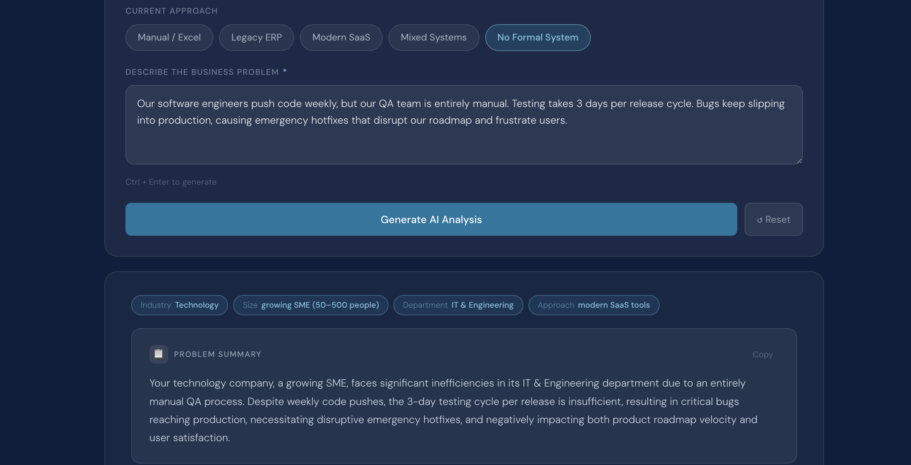

# Chiacon: AI Use Case Generator
### 48-hour take-home assignment, AI Consultant role

**Live site:** [https://chiacon-ai-demo-orpin.vercel.app/](https://chiacon-ai-demo-orpin.vercel.app/)

> Built end to end in 48 hours.

---

## Table of contents

1. [Assignment brief](#assignment-brief)
2. [What I built](#what-i-built)
3. [Screenshots](#screenshots)
4. [Core AI feature](#core-ai-feature)
5. [Beyond the brief: 5 extra features](#beyond-the-brief-5-extra-features)
6. [Tech stack](#tech-stack)
7. [Architecture](#architecture)
8. [Project structure](#project-structure)
9. [How to run locally](#how-to-run-locally)

---

## Assignment brief

Build a simple, clean webpage that:

- Demonstrates Chiacon's AI capability
- Includes a headline, a short description, and 2 to 3 AI use cases
- Has one working AI feature, specifically Option A: AI Use Case Generator
  - User inputs a business problem
  - AI returns a problem summary, 2 to 3 AI opportunities, and expected business impact
- Is deployed and accessible via a live link
- Includes a README explaining the stack and how it works

Time limit: 48 hours.

---

## What I built

I delivered the full brief, then went further.

The result is a complete single-page application with a clear brand identity, two input modes (wizard and all-at-once), strict guardrails on the AI layer, and five extra features that turn a demo into a usable consulting tool.

The page is structured as:

- Navigation: sticky, blurred header with logo, section links, history dropdown, theme toggle, and a CTA
- Hero: headline, subtext, two CTAs, and a capabilities card
- Services: four pillars (Analytics, RPA, QA, Project Catalysts) in a grid
- AI use cases: three real-world cards with context and Chiacon's approach
- AI demo: the live AI Use Case Generator, the centrepiece of the assignment

---

## Screenshots

### Light mode, home


### Dark mode, hero


### Dark mode, about and services


### Light mode, about and services


### AI demo, input panel


### Step-by-step wizard mode


### AI output, full results panel


### Feature highlight, ROI calculator and roadmap


### Results, history dropdown


---

## Core AI feature

### AI Use Case Generator

The user provides context about their business problem through one of two input modes.

**All-at-once mode.** The user selects chips for industry, company size, department, and current approach, then types a free-text description. Ctrl+Enter triggers generation.

**Step-by-step wizard mode.** A guided, animated flow presents one question at a time with progress tracking, dot indicators, back and skip navigation, and auto-advance on chip selection.

Both modes call the same backend endpoint.

**What the AI returns:**

| Field | Description |
|---|---|
| `summary` | 2 to 3 sentence restatement of the core problem |
| `opportunities[3]` | Named solutions with tech stack and a one-line explanation each |
| `roi_metrics.time_saved` | Punchy metric, max 10 words |
| `roi_metrics.cost_reduction` | Punchy metric, max 10 words |
| `roi_metrics.hours_saved_per_month` | Integer used by the ROI calculator |
| `roadmap[3]` | Phase name, timeframe, and a one-line description for each of 3 delivery phases |

**Guardrails.** Every request is validated before a response is returned. Off-topic inputs (general knowledge, jokes, creative writing), vague inputs ("help me"), and inappropriate content all return `isValid: false` with a polite message. The frontend surfaces this cleanly and never treats a rejected input as an error.

**Follow-up and refinement.** After a result is generated, a follow-up bar appears with five quick-chip prompts (cost reduction, implementation steps, prioritisation, risks, timeline) and a free-text input. Follow-up messages are appended to the full conversation history and sent back to the API, so the model has full context for each refinement.

---

## Beyond the brief: 5 extra features

The assignment asked for one working AI feature. I added five more to show what a real consulting tool looks like.

---

### 1. Global dark and light mode toggle

**Where:** top navigation, a sun and moon icon button to the left of the CTA.

**What it does:** flips the entire site's palette between a light scheme and a deep navy dark scheme. The transition is smooth (CSS `transition: background .25s`). The preference is saved to `localStorage` so it survives refresh and return visits.

**How it works:** CSS variables on `:root` define the light palette. A `[data-theme="dark"]` attribute on `<html>` overrides them. `initTheme()` reads from `localStorage` on load. `toggleTheme()` flips the attribute and writes back. No framework, no class toggling on hundreds of elements, one attribute change cascades through the whole design.

> Screenshot: compare `Light_Home.png` and `DarkMode.png`

---

### 2. Session history (local storage)

**Where:** a "Recent" button in the navigation that opens a dropdown.

**What it does:** every time a valid analysis is generated, the full JSON result, the user's context answers, and a timestamp are saved to `localStorage`. Up to 5 entries are kept (oldest dropped). Clicking a past entry re-renders the full report instantly, with no API call.

**How it works:** `saveAnalysisToHistory()` writes to `localStorage` under `chiacon_history`. `renderHistoryDropdown()` builds the panel. `loadHistoryEntry()` reconstructs the conversation array (for follow-up continuity), calls `renderResult()` with `isInstant: true` (which skips typewriter animations), and scrolls the result into view.

A user can generate analyses for different clients and switch between them instantly.

> Screenshot: `UI_Inbox.png`

---

### 3. Interactive ROI calculator

**Where:** below the three ROI metric cards, inside the result panel.

**What it does:** a slider sets an average employee hourly rate ($20 to $200/hr, default $40). As it moves, a large dollar figure updates live: `hours_saved_per_month x hourly_rate x 12 = annual value recovered`.

**Why it matters:** the AI returns a raw integer (`hours_saved_per_month`) derived from the described problem. The calculator makes that number personal, since a logistics company and a fintech startup have very different hourly rates.

**Backend change:** `roi_metrics.timeline` was replaced with `roi_metrics.hours_saved_per_month` (integer), and the string fields were capped at 10 words via the system prompt. The calculator is hidden from the `@media print` PDF export, since it is interactive, not a static report element.

> Screenshot: `Feature.png`

---

### 4. Executive audio briefing (Web Speech API)

**Where:** in the "Problem Summary" block header, left of the Copy button.

**What it does:** clicking "Play Briefing" reads the generated summary aloud using the browser's native `SpeechSynthesis` API. The button switches to "Stop" while playing. Clicking again cancels immediately. It resets when the user generates a new analysis, loads history, or resets the form.

**Why it matters:** an executive can listen to the summary instead of reading it, which is how real briefings are consumed.

**How it works:** `startAudioBriefing()` creates a `SpeechSynthesisUtterance`, sets rate and pitch, attaches `onend` and `onerror` handlers to reset the button, and calls `window.speechSynthesis.speak()`. No third-party library, no API call, no cost. The button is hidden from the `@media print` CSS.

---

### 5. Dynamic implementation roadmap

**Where:** below the ROI calculator, inside the result panel.

**What it does:** renders a horizontal three-step CSS Flexbox stepper for the implementation journey. Each phase has a numbered circle, a name, a pill-style timeframe badge, and a one-line description, with a line connecting the circles.

**Backend change:** `roi_metrics.timeline` (a single string) was replaced with `roadmap`, a top-level array of exactly 3 objects: `{ phase, timeframe, description }`. The system prompt enforces exactly 3 phases with problem-specific content.

**Print compatibility:** the roadmap renders in the PDF export. The `@media print` block forces light backgrounds, removes dark borders, and overrides `display: none` so it always appears. On mobile the stepper switches from horizontal to vertical via a media query. `renderRoadmapStepper()` maps the array to HTML, and the connecting line is a CSS `::before` pseudo-element on the container.

> Screenshot: `Feature.png`

---

## Tech stack

| Layer | Technology | Reason |
|---|---|---|
| Frontend | Vanilla HTML, CSS, JavaScript | Zero build step, instant deploy, full control |
| Fonts | Instrument Serif and DM Sans (Google Fonts) | Editorial serif for headings, refined sans for UI |
| AI model | Google Gemini 2.5 Flash | Fast, high-quality JSON output; `responseMimeType: 'application/json'` enforces structured responses |
| Backend | Vercel serverless function (Node.js) | A single `api/chat.js`; keeps the API key server-side |
| Deployment | Vercel | Zero-config deploy from one HTML file and one API route |
| Storage | Browser `localStorage` | No database; history and theme are per-user and client-side |
| Speech | Native `window.speechSynthesis` | No dependency, no cost, works in modern browsers |

---

## Architecture

```
Browser (index.html)
│
│  User fills context + problem
│  JS calls /api/chat with conversation history array
│
▼
Vercel Serverless Function (api/chat.js)
│
│  Attaches system prompt (guardrails + JSON schema)
│  Forwards to Gemini 2.5 Flash API
│  Returns raw JSON text to browser
│
▼
Browser
│
│  Strips any markdown fences
│  JSON.parse() the response
│  Validates isValid flag
│  Renders result with typewriter animation
│  Saves to localStorage history
```

**Conversation continuity:** the full message history (user and assistant turns) is kept in a `conversation` variable and sent with every request, so follow-up questions have full context.

**No streaming:** the full JSON must be valid before it can render, so streaming is intentionally not used. A loading animation (cycling through three thinking steps) provides perceived responsiveness.

---

## Project structure

```
chiacon-ai-demo/
├── index.html          # Entire frontend: HTML, CSS, JS in one file
├── api/
│   └── chat.js         # Vercel serverless function, Gemini API proxy
├── Assets/
│   ├── Light_Home.png
│   ├── DarkMode.png
│   ├── DarkMode_about.png
│   ├── LightAbout.png
│   ├── AI_Demo.png
│   ├── Sequential_UI.png
│   ├── UI_output.png
│   ├── Feature.png
│   └── UI_Inbox.png
└── README.md
```

The frontend is a single `index.html` file, no bundler, no framework, no build step. The assignment asked for a working prototype delivered fast, and a single-file setup means zero config and instant Vercel deployment.

---

## How to run locally

**Prerequisites:** Node.js 18+, a Vercel account (free), a Gemini API key (free tier at [aistudio.google.com](https://aistudio.google.com)).

```bash
# 1. Clone the repository
git clone https://github.com/Nishant7p/chiacon-ai-demo.git
cd chiacon-ai-demo

# 2. Install the Vercel CLI
npm install -g vercel

# 3. Create a local environment file
echo "GEMINI_API_KEY=your_key_here" > .env.local

# 4. Run locally
vercel dev
```

Open http://localhost:3000. The serverless function runs locally through Vercel Dev, so no separate backend server is needed.

**To deploy:**

```bash
vercel --prod
```

Set `GEMINI_API_KEY` as an environment variable in your Vercel project under Settings, Environment Variables.
